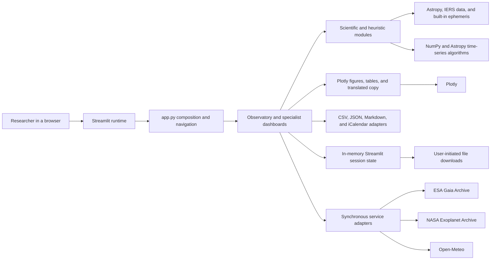
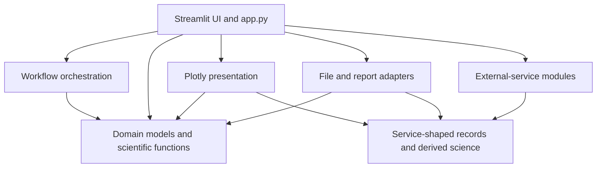

# Mission 19 — Architecture & Limitations Map

## Executive view

AstroScope is a Streamlit application with a broad reusable Python calculation layer; the
repository defines no separate API or worker process. The application is separated into five
navigation destinations, but the separation is primarily by convention rather than by enforced
architecture. UI entry points import domain, presentation, file-adapter, and external-service
modules directly. There is no application service layer, dependency-injection boundary,
persistent repository, or declared public package API.

The strongest existing seam is the collection of immutable dataclasses and deterministic
functions under `src/astroscope`. Most astronomy, equipment, light-curve, transit, serialization,
and figure-building code can run without Streamlit. The highest-risk boundary is the default
Observatory page: `render_observatory_page()` remains a 3,800-plus-line UI orchestrator inside the
4,063-line `app.py`. The catalogue and weather modules are the next most important seams because
they combine remote transport, response parsing, scientific derivation, and result construction.

**Architecture classification:** modular scientific prototype with reusable cores, but with a
UI-centred composition root, mixed infrastructure boundaries, and no enforced dependency rule.

## Scope and evidence

This map describes the repository after Mission 18. It documents the current system and proposes
refactor boundaries; it does not implement those refactors.

- Baseline branch: `main`
- Baseline commit: `f0d617d81ef7e472ba1de9fb9815155a1d61a63d`
- Baseline pull request: PR #8, Research Baseline Audit
- Audit date: 2026-08-03
- Application entry point: 4,063-line `app.py`
- Package inventory: 58 Python files under `src/astroscope`
- Streamlit entry points: `app.py` and four specialist dashboard modules
- Test baseline: 43 files and 702 collected cases

The evidence used for this map includes module imports, public dataclasses and functions, page
composition, state keys, remote-service call paths, file import/export paths, exception handling,
resource limits, tests, and CI configuration. No live external service was queried.

## System context



There is no database, background worker, queue, API server, durable cache, or hardware-control
boundary in the repository. Streamlit owns request execution, reruns, widget state, and the
lifetime of in-memory results.

## Logical boundaries

| Boundary | Current modules | Responsibility | Current boundary condition |
|---|---|---|---|
| Composition and navigation | `app.py` | Page configuration, shared language selector, `st.navigation`, five `st.Page` definitions | Imports every major subsystem directly and contains the Observatory implementation |
| Streamlit UI | `app.py`, `*_dashboard.py` | Widgets, forms, rendering order, user feedback, session state, downloads | Four dashboards mix rendering with request/default/table/export helpers |
| UI copy | `i18n.py`, `*_messages.py`, `light_curve_i18n.py`, `transit_schedule_i18n.py` | Four-language labels, explanations, warnings, and chart copy | `i18n.py` aggregates many dictionaries; light-curve i18n imports presentation label types |
| Scientific domain | Coordinate, visibility, ephemeris, equipment, light-curve, and transit modules | Validated data models and calculations | Mostly Streamlit-free and deterministic; units and conventions remain uneven |
| Heuristic planning | `planner.py`, `schedule.py`, `weather.py`, `transit_ranking.py` | Scores, ratings, target selection, and observation priorities | Heuristics are returned beside physical quantities without a common calibration/provenance model |
| Application orchestration | `sky_map.py`, `schedule.py`, `transit_schedule.py` | Combine lower-level calculations into user-facing workflows | `sky_map.py` and `schedule.py` also construct Plotly figures |
| Presentation | `*_visuals.py`, `weather_charts.py`, figure functions in `sky_map.py` and `schedule.py` | Plotly figures and display-oriented transformations | Some figures depend directly on service-shaped catalogue records |
| File and report adapters | `*_export.py`, `light_curve_io.py`, `observation_log.py`, `observation_report.py` | CSV, JSON, Markdown, and iCalendar conversion | Domain models and serialization are sometimes colocated; no common provenance envelope |
| External-service adapters | `gaia_catalog.py`, `exoplanet_catalog.py`, `weather.py` | Query construction, HTTP, decoding, schema parsing, derived values, summaries | Transport, parsing, and science are combined in each module |
| Runtime dependencies | Streamlit, Astropy, NumPy, Plotly, `zoneinfo` | UI runtime, astronomy/time, numerical analysis, charts, timezone conversion | Minimum versions only; no locked research environment |

### External-service boundary

| Dependency | Current adapter and protocol | Data entering the system | Boundary behavior |
|---|---|---|---|
| ESA Gaia Archive | `gaia_catalog.py`; synchronous TAP `POST` to `https://gea.esac.esa.int/tap-server/tap/sync` | UTF-8 CSV for `gaiadr3.gaia_source` | User-set timeout, HTTP/content checks, injected opener for tests; no retry, cache, response snapshot, or retrieval metadata |
| NASA Exoplanet Archive | `exoplanet_catalog.py`; synchronous TAP `GET` to `https://exoplanetarchive.ipac.caltech.edu/TAP/sync` | UTF-8 CSV for `pscomppars` | User-set timeout, HTTP/content checks, injected opener for tests; no retry, cache, response snapshot, or retrieval metadata |
| Open-Meteo | `weather.py`; synchronous `GET` to `https://api.open-meteo.com/v1/forecast` | Hourly JSON forecast fields | Fixed request path and timeout, schema validation; no injected client at the top-level fetch boundary, retry, cache, model-run identity, or offline mode |
| Astropy ephemeris/IERS | Direct calls from scientific modules | Built-in body positions and time-dependent Earth-orientation data | No project-level adapter, freshness policy, or recorded reference-data version |
| System timezone database | `observer.py` through `zoneinfo` | UTC offsets and daylight-saving rules | Invalid names are rejected; tzdata version is not captured in results |

Remote catalogue and weather calls originate from page-render execution. No service facade
coordinates rate limits, retries, cached fallbacks, provenance, or health state across them.

### Page topology

`run_app()` creates the following callable pages with `st.navigation`:

| Page | Entry function | Primary implementation | State and external effects |
|---|---|---|---|
| Observatory | `render_observatory_page()` | Inline in `app.py` | Many widget and logbook session keys; Open-Meteo calls; downloads |
| Light Curve Laboratory | `render_light_curve_page()` | `light_curve_dashboard.py` | Uploaded text, analysis results in session state, CPU-bound period/transit searches, downloads |
| Gaia DR3 Explorer | `render_gaia_page()` | `gaia_dashboard.py` | Synchronous Gaia TAP call, one stored result, CSV download |
| Exoplanet Explorer | `render_exoplanet_page()` | `exoplanet_dashboard.py` | Synchronous NASA TAP call, one stored result, CSV download |
| Transit Schedule | `render_transit_schedule_page()` | `transit_schedule_dashboard.py` | CPU-bound prediction/visibility/ranking, one stored result, CSV/JSON/ICS downloads |

All pages call the shared sidebar language selector. Navigation separates destinations, but the
specialist pages are still imported eagerly by `app.py`, and `st.set_page_config()` executes at
module import time.

## Dependency direction



The arrows show observed imports, not an enforced target architecture. Notable consequences are:

- The UI can bypass orchestration and call low-level calculations, figure factories, or network
  functions directly.
- Gaia and Exoplanet figures and exporters depend on record classes declared in their catalogue
  service modules.
- `weather.py` is simultaneously a service client, parser, domain model, and heuristic scorer.
- `schedule.py` and `sky_map.py` expose both calculations and Plotly construction.
- `__init__.py` is empty, so consumers import internal modules rather than a stable public API.
- No import-lint, type-checking, or architectural test prevents dependency direction from
  changing.

### Test boundary

- Scientific cores, serializers, exporters, and Plotly builders have broad unit and parametrized
  coverage.
- Catalogue and weather transport tests substitute responses rather than querying live services.
- Light Curve and Transit Schedule dashboards have tests using fake Streamlit surfaces.
- `app.py` navigation and the Gaia and Exoplanet dashboards have no direct application-level
  coverage.
- CI verifies Ruff and pytest on Python 3.12, but not layer direction, type contracts, deployment
  startup, resource budgets, or external-service compatibility.

## Major data flows

### 1. Navigation and shared UI context

`Streamlit startup → app.py import → page configuration → st.navigation → selected callable →
language selector → page render`

The language code is passed into dashboards and message helpers. It is not a domain input, but it
also supplies some chart-label dataclasses. A Streamlit rerun repeats the active page function;
durable intermediate work therefore depends on explicit `st.session_state` entries.

### 2. Observatory calculations

`widgets → primitive Python values → astroscope calculation → frozen result dataclass → metrics,
tables, or Plotly figure`

This pattern covers observer time, coordinate conversion, horizontal visibility, Solar System
positions, telescope simulation, and imaging geometry. The calculation boundary is generally
reusable, but `app.py` owns preset selection, default thresholds, input-to-model conversion,
translation lookup, exception display, figure assembly, and download controls.

### 3. Sky map, planner, and night schedule

`observer/time widgets → sky_map or planner → coordinates/observer/visibility/solar_system →
points or ranked entries → schedule sampling → greedy blocks → Plotly`

`calculate_observation_schedule()` repeatedly calls `calculate_observation_plan()` across a local
time grid. Planner calls repeat coordinate and ephemeris work for each target and time. The night
schedule then selects the highest-ranked recommended target per interval and merges contiguous
slots. There is no shared computation cache or resource-budget abstraction.

### 4. Weather

`location/date widgets → build Open-Meteo URL → synchronous urllib request → JSON decode → hourly
schema validation → project-defined weather score/dew risk → charts`

Network transport, response interpretation, derived scoring, and result construction occur in
`weather.py`. The UI catches expected validation/service errors, but there is no retry, cached
snapshot, model-run provenance, or stale-data mode.

### 5. Gaia DR3

`search widgets → GaiaConeSearchRequest → ADQL builder → synchronous TAP POST → UTF-8 CSV parser →
GaiaSource records and naive derived quantities → summary → session state → table/figures/CSV`

The result retains the ADQL query, but not retrieval time, archive response metadata, or an
environment snapshot. Distance and absolute magnitude are calculated while parsing records, so
raw service data and project-derived science share one model.

### 6. NASA Exoplanet Archive

`filter form → ExoplanetSearchRequest → ADQL builder → synchronous TAP GET → UTF-8 CSV parser →
ExoplanetRecord plus derived density/transit/temperature classifications → summary → session
state → figures/inspector/CSV`

The population figures and educational transit simulator consume catalogue records directly.
The symmetric trapezoid transit calculation lives in `exoplanet_visuals.py`, placing a scientific
approximation inside the presentation boundary.

### 7. Light-curve analysis

`uploaded bytes → UTF-8 decode → column detection → LightCurveMetadata → CSV import and validation
→ optional clipping/normalization → Lomb–Scargle or Box Least Squares → phase/diagnostics →
session state → figures and exports`

The reusable scientific chain is well separated after import. The dashboard nevertheless owns
scientific defaults derived from cadence and baseline, processing order, a default time standard,
minimum observation gates, state invalidation, and which diagnostic products are retained. When
no time standard is detected, the UI assigns `BJD_TDB`; that value is not established by the
uploaded numbers alone.

### 8. Transit scheduling

`site/target/date widgets → dashboard input dataclasses → UTC calendar dates converted to Julian
dates → ephemeris prediction → sampled target/Sun/Moon visibility → heuristic ranking → session
state → table, figures, CSV, JSON, and iCalendar`

The core path through `transit_scheduler.py`, `transit_visibility.py`,
`transit_ranking.py`, and `transit_schedule.py` is reusable. Date conversion, request construction,
table shaping, filenames, and bundled exports remain in the Streamlit dashboard module.

### 9. Observation logbook

`widgets or uploaded JSON → session/equipment/target dataclasses → session-state list → summary →
JSON/CSV/Markdown downloads`

The domain records and serializers are reusable. The active log exists only in Streamlit session
memory until the user downloads it. There is no repository, autosave, concurrent edit model, or
schema migration service beyond the import validation implemented in `observation_log.py`.

## State, persistence, and provenance

| State type | Current mechanism | Lifetime | Limitation |
|---|---|---|---|
| Widget values | Streamlit widget state | Browser session/process dependent | Keys are string literals distributed through UI modules |
| Analysis results | `st.session_state` | Current Streamlit session | Lost on reset/redeploy; no version or provenance check when restored |
| Uploaded light curves/logs | In-memory uploaded bytes | Current rerun/session | No durable source identifier, checksum, access policy, or upload-size policy in project code |
| Catalogue/weather results | In-memory result dataclasses | Current session | No cache, retrieval timestamp, service version, or offline snapshot |
| Observation logbook | Session-state dataclasses | Current session until download | No autosave, database, or recovery journal |
| Scientific exports | Browser downloads | User-controlled after creation | Provenance fields and environment versions are incomplete and inconsistent |

There is no cross-page application-state model. Each dashboard owns independent string keys and
manual invalidation rules. Equality checks protect some light-curve results from becoming stale,
but there is no general association between a result, its complete input configuration, the code
version, and the dependency/data versions that produced it.

## Reusable scientific components

### Strong current seams

| Capability | Reusable modules | Why the seam is useful |
|---|---|---|
| Observer, coordinates, and visibility | `observer.py`, `coordinates.py`, `visibility.py` | Validated inputs, immutable outputs, no Streamlit dependency |
| Solar System geometry | `solar_system.py` | Callable calculation boundary with explicit result fields and ephemeris name |
| Telescope and imaging | `telescope.py`, `imaging.py` | Deterministic equipment models and comparison functions |
| Light-curve models and analysis | `light_curve.py`, `light_curve_processing.py`, `light_curve_period.py`, `light_curve_phase.py`, `light_curve_transit_search.py`, `light_curve_transit_diagnostics.py` | Domain-specific models, explicit errors, and testable algorithms |
| Transit prediction and visibility | `transit_scheduler.py`, `transit_visibility.py`, `transit_ranking.py`, `transit_schedule.py` | Layered prediction, geometry, scoring, and orchestration with immutable results |
| Observation records | `observation_log.py`, `observation_report.py` | Validated records and deterministic serialization/reporting |
| Export adapters | `*_export.py`, `light_curve_io.py`, `transit_schedule_exports.py` | Callable text/byte transformations outside Streamlit |
| Plotly builders | Most `*_visuals.py`, `weather_charts.py` | Reusable for notebooks or other front ends, although presentation-specific |

### Scientific or workflow decisions still bound to UI modules

- `app.py` owns Observatory defaults, preset selection, request assembly, logbook state transitions,
  and all cross-section orchestration.
- `light_curve_dashboard.py` owns cadence-based period/transit defaults, processing order,
  `BJD_TDB` fallback, result invalidation, and translated photometry mapping.
- `transit_schedule_dashboard.py` owns UTC date-to-Julian-date conversion, dashboard input models,
  domain request construction, display rows, and export filename policy.
- `gaia_dashboard.py` and `exoplanet_dashboard.py` own request-form defaults, result table shaping,
  selected-record lookup, and chart-label construction.
- Every helper in a dashboard module requires importing Streamlit even when the helper itself is
  pure. This couples headless consumers and tests to a UI dependency.

### Mixed modules

| Module | Mixed responsibilities | Refactor pressure |
|---|---|---|
| `gaia_catalog.py` | ADQL, HTTP POST, response checks, CSV parsing, raw catalogue model, distance/absolute-magnitude derivation, summary | External schema changes and scientific changes share one failure surface |
| `exoplanet_catalog.py` | ADQL, HTTP GET, CSV parsing, raw catalogue model, derived physics/classification, summary | Raw/archive provenance cannot be separated cleanly from project calculations |
| `weather.py` | URL construction, HTTP/JSON, schema parsing, weather model, score/rating/dew heuristic | Transport reliability and observing policy cannot evolve independently |
| `schedule.py` | Local time grid, repeated planning, greedy block selection, Plotly | Scientific/workflow testing and presentation changes touch one module |
| `sky_map.py` | Object aggregation, local-sky calculation, radial display transform, Plotly | Domain positions and chart decisions share types and module imports |
| `exoplanet_visuals.py` | Plotly population figures plus trapezoidal transit approximation | A scientific approximation is hidden inside a presentation namespace |
| `observation_log.py` | Domain records, schema validation, JSON parsing/serialization, CSV export | Persistence/schema evolution would affect the core record module |

## Architectural coupling and risks

| Finding | Evidence | Consequence | Priority |
|---|---|---|---|
| Observatory monolith | One 3,800-plus-line render function in 4,063-line `app.py` | High review cost, broad regression surface, no focused page tests | High |
| Direct UI-to-everything dependencies | UI imports calculations, charts, serializers, and network clients | No use-case boundary for consistent validation, provenance, or errors | High |
| Layering is conventional only | No architecture tests or dependency rule | New changes can silently move science into UI or infrastructure | Medium |
| Service, parse, and science coupling | Gaia, Exoplanet, and Weather modules combine those concerns | Service contract failures can be mistaken for scientific regressions | High |
| Service-shaped presentation | Gaia/Exoplanet visuals and exports import catalogue record types | Changing raw schemas propagates into charts and exports | Medium |
| Duplicate scientific concepts | Airmass, Moon illumination, visibility thresholds, time conversions, and scoring appear in multiple modules | Conventions and formulas can drift between features | High |
| Primitive obsession | Bare floats represent JD, duration, angle, magnitude, flux, uncertainty, and distance | Unit/time-scale errors can cross boundaries undetected | High |
| UI-owned scientific defaults | Dashboard cadence rules, thresholds, and fallback metadata | Headless and UI workflows may produce different policies | High |
| Stringly typed session state | Distributed literal keys and manual invalidation | Stale or incompatible state is difficult to detect systematically | Medium |
| Import-time UI side effect | `st.set_page_config()` runs during `app.py` import | Headless testing and reuse of the composition module are harder | Medium |
| Undefined public API | Empty package `__init__.py` | Notebooks and future services must depend on internal file layout | Medium |
| Unpinned environment | Broad minimum dependency versions and one CI Python version | Numerical or rendering behavior can drift between installations | High |

## Failure-mode map

| Trigger | Current behavior | User/scientific consequence | Missing control |
|---|---|---|---|
| Gaia, NASA, or Open-Meteo unavailable | Synchronous request waits until timeout; expected errors are shown | Page interaction blocks and no result is produced | Retry/backoff, cached result, offline fixture, circuit breaker |
| External schema or error-document change | Parser/content checks raise a service or validation error | Feature becomes unavailable; transport versus schema cause may be unclear | Versioned contract fixture, structured adapter error, service telemetry |
| Stale Astropy IERS or timezone data | Runtime dependency behavior determines transforms | Time/position results may differ or warn across environments | Data-version policy, freshness reporting, pinned reference assets |
| Malformed light-curve upload | Initial decode, detection, and import have no dashboard-level error boundary | Streamlit may expose a page exception rather than a controlled recovery path | Upload boundary with encoding/schema errors and safe reset |
| Large light curve or dense search | Analysis runs synchronously in the Streamlit process | Long rerun, high CPU/memory, possible session interruption | Input limits, estimates, cancellation, worker/job boundary, benchmarks |
| Large transit request | Event and sample caps reject or bound some work | Valid large programmes may fail abruptly or still be expensive | Explicit resource budget and asynchronous batch interface |
| Browser refresh, session loss, or redeploy | Session-only results and logbook state disappear | Work must be rerun or reconstructed manually | Durable repository/autosave and reproducible request record |
| Input changes after stored result | Some dashboards manually clear or replace state | Incomplete invalidation can display stale results | Typed state object keyed by complete request fingerprint |
| Unexpected exception | No common application error boundary or structured logging | Inconsistent user feedback and weak diagnosis | Error taxonomy, correlation identifier, structured logs |
| Dependency upgrade | Minimum constraints permit new versions | Numerical output, warnings, or figure behavior may change | Lock/constraints file and reference regression suite |
| Process or host outage | No persistence or recovery layer | All active sessions and unsaved data are lost | Durable storage, backup, health checks, deployment runbook |

## Scientific limitations by architectural location

| Location | Limitation | Architectural significance |
|---|---|---|
| `observer.py`, `visibility.py`, `solar_system.py`, `planner.py`, `transit_visibility.py` | Time, frame, refraction, airmass, ephemeris, and Moon formulas are not governed by one conventions layer | Equivalent concepts can produce feature-specific results |
| `planner.py`, `schedule.py`, `transit_ranking.py`, `weather.py` | Scores and thresholds are transparent but uncalibrated heuristics | Policy needs a distinct interface and version before scientific comparison |
| `gaia_catalog.py` | Direct parallax inversion and uncorrected absolute magnitude are stored beside archive fields | Raw observations, derived values, method version, and uncertainty are not distinct |
| `exoplanet_catalog.py`, `exoplanet_visuals.py` | Simplified density, transit probability/depth, temperate screen, and trapezoid model | Educational approximations cross catalogue and presentation boundaries |
| `light_curve.py`, `light_curve_dashboard.py` | Float times inherit an implicit unit; the UI can assign `BJD_TDB` by default | Metadata can claim a time standard that the upload did not establish |
| Light-curve analysis modules | Aliases, correlated noise, systematics, model selection, and astrophysical confirmation are outside the models | Algorithm output must remain a candidate, not a discovery claim |
| Transit modules | Linear ephemeris, independent symmetric uncertainty, fixed duration, sampled visibility, heuristic ranking | Prediction confidence and observing priority are approximations without a shared uncertainty model |
| Telescope and imaging modules | Idealized optics, fixed sampling thresholds, approximate target sizes, simplified mosaics | Results describe educational geometry, not calibrated hardware performance |
| All scientific exports | Units, frame, time scale, input provenance, dependency versions, and method versions are not uniformly encoded | Results cannot yet serve as publication-grade reproducibility artifacts |

## Operational risks

| Risk | Current exposure | Required control before operational use |
|---|---|---|
| Single interactive execution path | Network and numerical work run inside page reruns | Separate long-running work from UI requests and define cancellation/time budgets |
| Ephemeral state | No database or durable object store | Persist requests, inputs, results, checksums, and audit history |
| No observability layer | No structured logging, metrics, traces, or service health model found | Add privacy-aware events, error categories, latency/resource metrics, and health checks |
| No application authorization model | Repository contains no user, role, or access-control layer | Define deployment boundary before accepting private observations or shared operations |
| External-service dependence | Three live public services with no cache/retry policy | Add adapter-level resilience, attribution, rate-limit handling, and reproducible snapshots |
| Reproducibility drift | Dependencies and reference data are not pinned | Produce a locked environment and versioned data bundle |
| No hardware safety boundary | No device drivers, interlocks, weather shutdown, or command authorization | Keep all outputs advisory until a separately designed control/safety layer exists |
| Limited deployment evidence | CI runs Ruff and pytest on Python 3.12, not application smoke, load, or recovery tests | Add page smoke tests, deployment checks, performance budgets, and failure drills |

## Recommended refactor seams

These are boundaries for later missions, not changes to implement in Mission 19.

1. **Thin the composition root.** Keep page configuration and `st.navigation` in `app.py`; move
   each Observatory section into a focused UI component with an explicit input/result contract.
2. **Introduce application use cases.** Add headless orchestration functions for catalogue search,
   weather retrieval, light-curve analysis, planning, logging, and transit scheduling. Streamlit
   should call use cases rather than coordinate low-level modules directly.
3. **Define external-service ports.** Separate query/request models, transport protocols, response
   parsers, and scientific transformations for Gaia, Exoplanet, and Weather. Preserve injectable
   test transports.
4. **Separate raw and derived catalogue records.** Retain source fields and provenance independently
   from project-derived distance, magnitude, transit, and classification products.
5. **Create a scientific conventions layer.** Centralize unit-bearing types, time scales, reference
   frames, ephemeris policy, refraction policy, airmass, Moon illumination, and shared thresholds.
6. **Version heuristic policies.** Treat planner, weather, and transit scores as named,
   configurable policy objects with versions, inputs, components, and calibration status.
7. **Move pure dashboard helpers.** Extract cadence defaults, request builders, date conversion,
   table shaping, filenames, and translated label factories so headless code need not import
   Streamlit.
8. **Split calculation from presentation.** Move Plotly functions out of `schedule.py` and
   `sky_map.py`; move the trapezoid transit approximation out of `exoplanet_visuals.py`.
9. **Add typed result state.** Associate stored results with complete request fingerprints, source
   checksums, code/data versions, and explicit invalidation instead of distributed string keys.
10. **Add provenance-aware exports.** Define a common result envelope containing units, time/frame
    conventions, source query or file hash, retrieval time, method version, dependency versions,
    and warnings.
11. **Declare a supported package API.** Export stable research-facing models and use cases while
    keeping UI and adapter internals private.
12. **Add error and observability boundaries.** Define validation, service, scientific, resource,
    and persistence errors; map them consistently to UI messages and structured diagnostics.

### Illustrative target package shape

```text
astroscope/
  domain/          # unit-bearing models, calculations, scientific conventions
  application/     # headless use cases and workflow result contracts
  infrastructure/  # TAP, weather, persistence, and reference-data adapters
  presentation/    # Plotly figures, tables, and export views
  ui/              # Streamlit pages, widgets, translations, and session adapter
```

This shape is illustrative. Refactors should be incremental and protected by characterization,
reference, and contract tests; a wholesale directory move would add risk without improving
scientific evidence by itself.

## Refactor order and safety gates

| Order | Seam | Evidence required before movement |
|---:|---|---|
| 1 | Pure helpers out of dashboard modules | Existing unit behavior plus focused helper tests |
| 2 | Observatory UI sections out of `app.py` | Streamlit navigation/page smoke tests and snapshot of current inputs/outputs |
| 3 | Plotly separation from `schedule.py` and `sky_map.py` | Numerical result tests independent of figure tests |
| 4 | Gaia/Exoplanet/Weather ports and adapters | Recorded contract fixtures, raw-response fixtures, and error taxonomy |
| 5 | Shared scientific conventions | Authoritative reference datasets and tolerances for every consolidated formula |
| 6 | Typed state and provenance | Round-trip schema tests, migration/version policy, and result fingerprint tests |
| 7 | Stable public research API | Consumer examples, semantic-version policy, and compatibility tests |

Scientific formulas must not be consolidated merely because they look similar. The existing
implementations first need reference comparisons that show which convention is correct for each
use case.

## Architecture readiness assessment

| Dimension | Current assessment | Phase 0 implication |
|---|---|---|
| Navigation composition | Adequate prototype | Five standalone destinations exist; composition remains eager and UI-specific |
| Domain reuse | Strong prototype | Most calculations are headless and immutable |
| Boundary enforcement | Weak | No use-case layer, ports, public API, or architecture tests |
| External-service isolation | Weak | Transport, parsing, science, and summaries are combined |
| State management | Preliminary | Session-only, string-keyed, and not provenance-aware |
| Failure isolation | Preliminary | Expected errors are often caught, but there is no common boundary or telemetry |
| Scientific convention control | Weak | Units, time standards, frames, uncertainty, and duplicate formulas need governance |
| Operational readiness | Not ready | No persistence, asynchronous work, observability, authorization, or safety layer |
| Refactor readiness | Ready for incremental work | Clear seams exist, provided characterization and scientific reference tests come first |

Mission 19 establishes the map needed to plan architecture work. It does not change application
behavior, scientific calculations, service contracts, persistence, or deployment.
